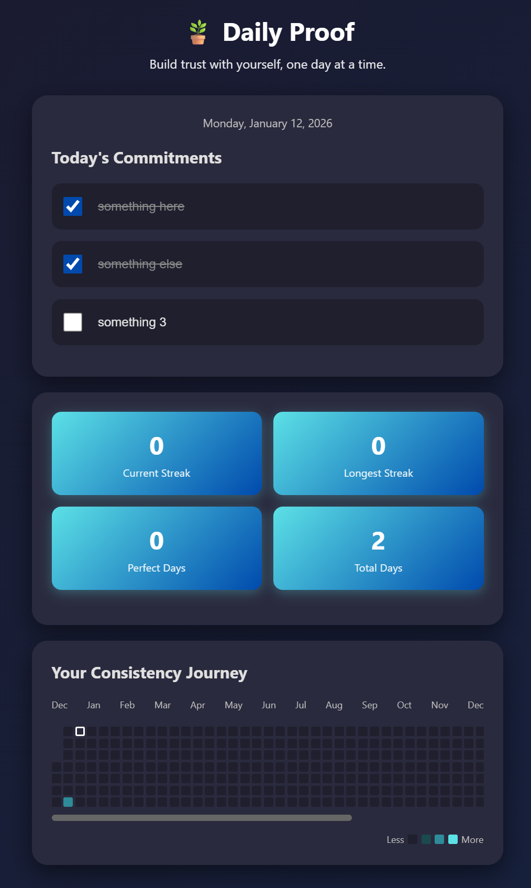

# 🪴Daily Proof 


A task tracker that helps you build self-trust by keeping promises to yourself each day.

Daily Proof is a lightweight “commit + complete” tracker that visualizes your consistency using a **daily commitments checklist** and an **activity heatmap**.

---

## Why Daily Proof?
Self-trust is built through evidence.

Daily Proof creates that evidence by helping you:
- choose what you commit to today
- complete what you promised yourself
- visually track consistency over time
- reduce overwhelm by keeping the system simple

---
## Screenshot

<p align="center">
  
</p>
---

## Features
- ✅ **Daily Commitments** checklist
- 🔥 **Heatmap** showing completion intensity by day
- 🧠 Designed to reinforce **self-trust + consistency**
- 💾 Data saved locally on the server (`tracker_data.json`)
- 📱 Mobile-friendly UI (PWA-ready)

---

## Tech Stack
- **Flask (Python)** for routing + API endpoints
- **HTML/CSS/Vanilla JS** frontend
- JSON persistence (`tracker_data.json`)
- Deployment-ready for **Render** using Gunicorn

---

## File Structure
```text
Daily-Proof/
├── self_trust_tracker.py
├── tracker_data.json
├── templates/
│   └── tracker.html
└── static/
    ├── style.css
    ├── app.js
    ├── manifest.webmanifest      # (optional) for PWA
    ├── sw.js                     # (optional) for PWA
    └── icons/                    # (optional) app icons
